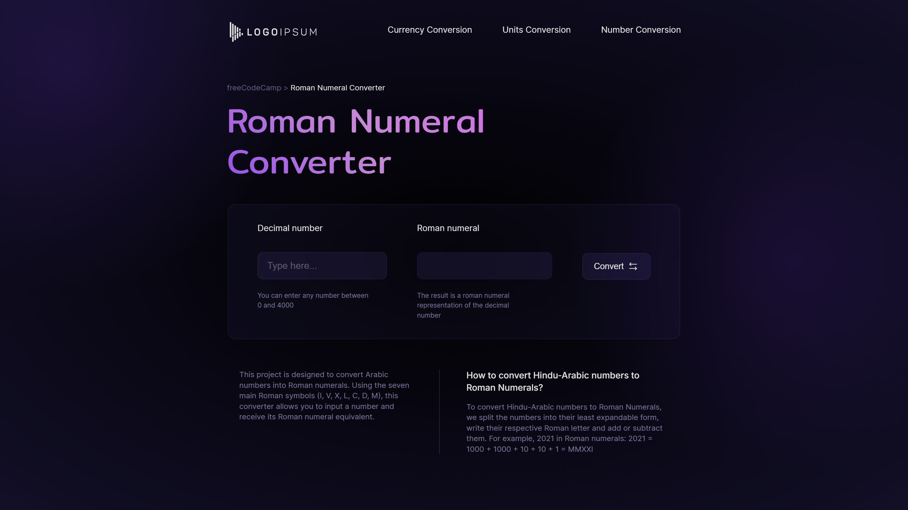

# 

 
 

The Roman Numeral Converter project was created as a certification requirement for the JavaScript Algorithms and Data Structures course from freeCodeCamp. The objective was to build an application that converts Hindu-Arabic numbers into Roman numerals, similar to the example provided. The app provides accurate conversion of numbers within the range of 1 to 3999 and handles invalid inputs properly.

> [!IMPORTANT]
> This project is part of the freeCodeCamp JavaScript Algorithms and Data Structures course. Although freeCodeCamp provides guidelines and user stories for certification projects, it does not offer tutorials or step-by-step guides for development. This project was built entirely from scratch using my own approach to meet the requirements.

 Screenshot

  

    

## 📝 Project Objective

The objective of this project was to develop an application that converts Hindu-Arabic numerals into Roman numerals, similar to <a href="https://roman-numeral-converter.freecodecamp.rocks/">this example</a>. The app needed to handle various input scenarios, including invalid inputs, numbers out of range, and valid conversions. This project provided an opportunity to practice some JavaScript techniques, particularly **recursion**, which was a key focus in the second module of the freeCodeCamp JavaScript Algorithms and Data Structures course.

## 🔧 Features

- **Input Field**: An `input` element with id `number` for users to enter a number.

- **Convert Button**: A `button` element with id `convert-btn` that triggers the conversion process.

- **Output Display**: A `div` element with id `output` that shows the Roman numeral representation of the entered number or an error message.

- **Validation and Alerts**: Handles invalid input with appropriate messages for cases such as empty input, numbers less than 1, or numbers greater than 3999.

- **Conversion Logic**: Uses recursion and a list of Roman numeral symbols to convert numbers to Roman numerals.

## 📖 Learnings

- **Recursion**: Implemented recursive functions to handle the conversion process efficiently.

- **DOM Manipulation**: Gained more experience in manipulating DOM elements and handling user interactions.

- **Error Handling**: Applied validation techniques to manage different types of user input and display appropriate messages.

- **Algorithm Design**: Developed an understanding of how to design algorithms for numeral conversions and other complex logic.

## 💻 Technologies Used

- **HTML5** for structuring the application.

- **CSS3** for styling and providing visual feedback.

- **JavaScript** for functionality, including DOM manipulation, recursion, and input validation.

## 💡 Acknowledgments

- **freeCodeCamp**: For providing the project guidelines and user stories that served as the basis for this application.

- **Ceptari Tyas**: For the design inspiration, found here: <a href="https://dribbble.com/shots/15144234-Binary-Converter-Darkmode">Dribbble - Binary Converter Darkmode</a>.
